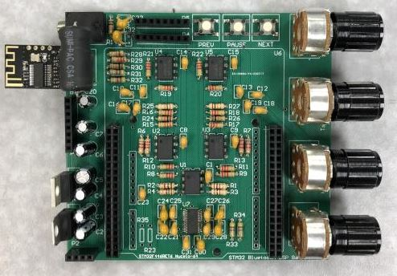

# BluetoothDSPSpeaker  
Real-time DSP PCB backpack for an STM32F446 Nucleo breakout board   
  
**Analog:**  
Board is powered with 9V and uses two voltage regulators to achieve 5V and 3V3  
NE5532 Op-amps chosen because of low noise, higher current capabilites and popularity in the audio industry  
Op-amps were supplied with a single 5V rail, meaning every op-amp was biased with 2.5V to achieve maximum end-to-end amplification  
Voltage followers used to establish 2.5V bias voltages for the left and right channels individually  
Baxandall volume control used to achieve a logarithmic volume response while using a linear dual-gang potentiometer for control.  
Bass and treble control achieved through first-order filters and dual-gang potentiometers.  
Another potentiometer used for the ADC hardware on the digital end  
Bluetooth reciever interfaced with resistors and buttons to allow the user to access the previous song, next song, and pause the song from on the board itself  
Bypass caps for every IC, microcontroller power pins, and the codec  

**Digital:**
STM32F446x ARM microprocessor used along with the STM32 Cube IDE  
I2C driver written for the TLV320AIC23B Stereo Audio Codec  
I2S used to receive and transmit data between the microcontroller and the codec  
DMA and ping pong buffers used to offload calculations from the microcontroller  
Reverb filter implemented with parameters varying based on ADC values  

